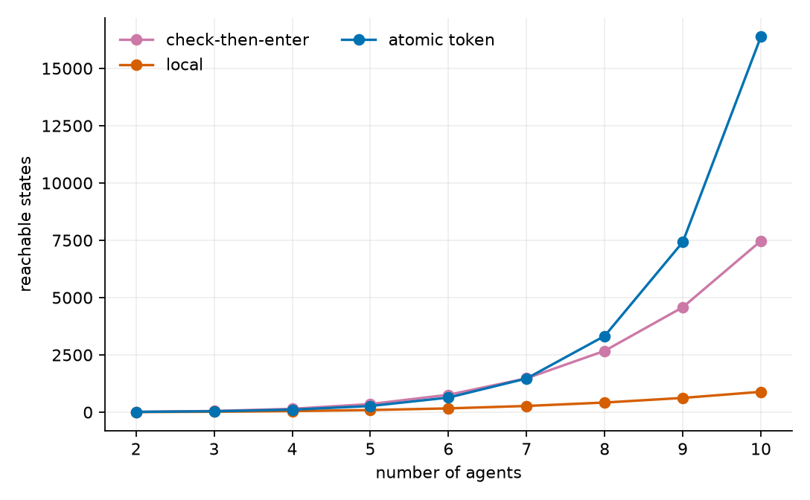
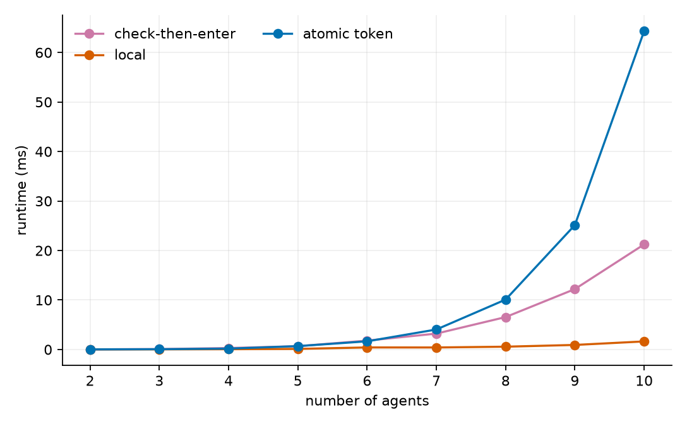
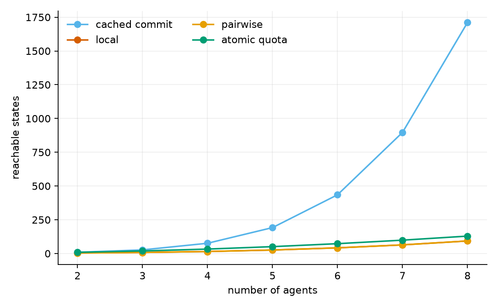
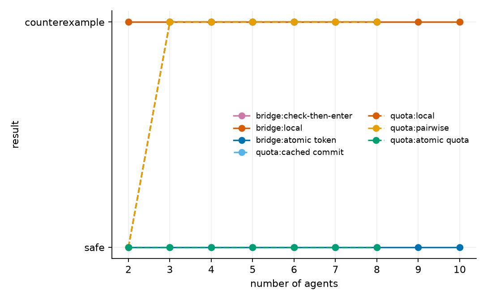
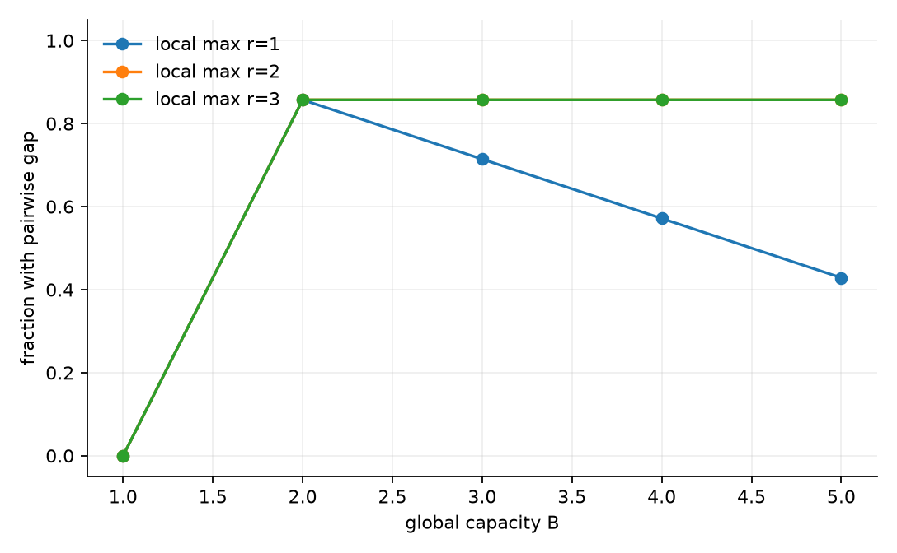

# 从安全反例到桥接不变量：多智能体系统的有限状态验证

## 1. 项目说明

本项目研究有限状态多智能体系统中，局部安全和两两安全何时不足以保证高阶安全，以及简单桥接协议能否恢复全局安全。所有结果来自确定性的显式状态 BFS 和有限域不变量检查。

> 证据范围：结论只对代码中明确的有限状态模型、动作和参数成立。搜索未发现反例时，报告使用“该有限模型中安全”，不外推到任意规模系统。

## 2. 模型与安全性质

### 2.1 共享窄桥

每个 Agent 的位置状态为 `away=0`、`wait=1`、`on=2`，桥容量为 1：

$$\Phi_{bridge}=\sum_i [q_i=on]\le 1.$$

比较 local、check-then-enter 和 atomic token 三种协议。

### 2.2 群体配额

每个 Agent 的消耗为 $p_i$，总容量为 $B$：

$$\Phi_{quota}=\sum_i p_i\le B.$$

比较 local、pairwise、check-then-commit 和 atomic quota。

## 3. 实验设置

- 窄桥 Agent 数量：$n=2,3,\ldots,10$。
- 配额动态模型：$n=2,\ldots,8$、$B=1,2,3,4$、局部上限 $r=1,2$。
- 静态容量基线：$n=2,\ldots,8$、$B=1,\ldots,5$、$r=1,2,3$。
- 每个配置从固定初始状态开始，使用 BFS 搜索最短反例。
- 状态上限为 2,000,000；本次配置均未触发上限。
- 对 token/quota 在 $n=2,3,4,5$ 上枚举完整有限候选域，检查初始化、保持性和安全蕴含。

## 4. 实验结果

### 4.1 反例搜索

| 模型 | 协议 | n=2 | n=3–8 | 最短反例 |
|---|---|---|---|---|
| bridge | check-then-enter | counterexample | counterexample … counterexample | 6 |
| bridge | local | counterexample | counterexample … counterexample | 4 |
| bridge | atomic token | safe | safe … safe | — |
| quota | cached commit | safe | counterexample … counterexample | 6 |
| quota | local | safe | counterexample … counterexample | 3 |
| quota | pairwise | safe | counterexample … counterexample | 3 |
| quota | atomic quota | safe | safe … safe | — |

共运行 251 组动态配置，其中 149 组发现反例；另有 105 组静态容量配置，其中 66 组显示两两约束不足。

窄桥中，local 在所有 $n$ 上出现 4 步反例，check-then-enter 出现 6 步反例；atomic token 在 $n=2$ 至 $10$ 中未发现违规状态。配额主设置 $B=2,r=1$ 中，local 和 pairwise 从 $n=3$ 开始出现 3 步反例；cached commit 从 $n=3$ 开始出现 6 步竞态；atomic quota 未发现反例。











### 4.2 最短反例

窄桥 local 的最短轨迹为：

```text
initial → request(0) → enter(0) → request(1) → enter(1)
```

最终状态为 `(on_0, on_1)`，违反桥容量为 1 的安全性质。

cached commit 的反例包含两个 Agent 先后读取“有剩余容量”，再使用缓存完成提交。

### 4.3 归纳证书

8 组完整有限域检查全部通过：

| 模型 | n 范围 | base | step | invariant ⇒ safety |
|---|---:|---:|---:|---:|
| bridge | 2–5 | True | True | True |
| quota | 2–5 | True | True | True |

token 和 quota 桥接不变量在枚举的完整有限候选域中满足初始化、所有动作保持性以及对全局安全的蕴含。这是有限模型内的形式证书，不是任意规模系统的定理。

### 4.4 参数敏感性

静态容量扫描覆盖 105 组参数组合，其中 66 组出现两两安全但全局容量不安全的分配。缺口随 Agent 数量、局部上限和容量共同变化，说明两两检查不能作为固定的安全充分条件。

## 5. 结论

1. 单体安全和两两安全不能覆盖高阶总量约束。
2. 非原子检查和提交会产生动态竞态，BFS 可以给出最短反例。
3. 唯一令牌和原子配额协议在给定有限模型中恢复了全局安全。
4. 参数扫描支持上述现象不依赖单一 Agent 数量；但结论仍受限于模型语义。

## 6. 复现

```powershell
cd mas-bridge-verification
python run_experiments.py
python make_report.py
```

原始结果见 `data/experiments.csv`、`data/static_capacity_sweep.csv`、`data/counterexamples.json` 和 `data/certificates.json`；运行环境与命令见 `data/provenance.json`。

## 7. 限制

- 模型采用有限整数状态，不代表真实 LLM Agent 的行为。
- 调度是确定性的全状态枚举，没有测量真实网络延迟。
- 协议安全依赖 owner/quota 管理器可信。
- 尚未研究活性、饥饿、故障恢复和恶意协议实现。
